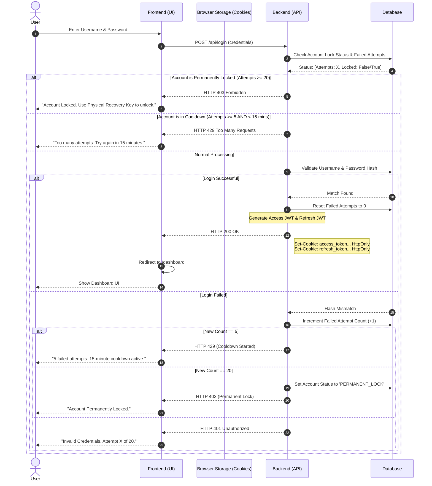
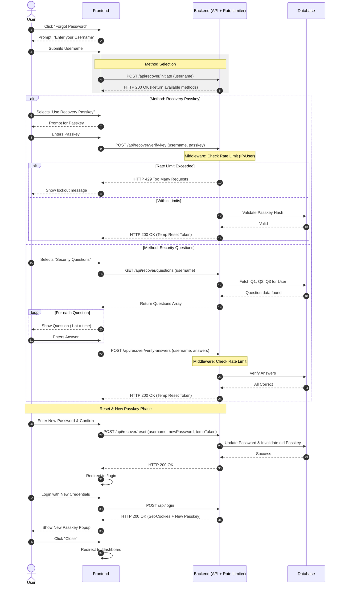

# Authentication Module

<details>
<summary><b>Signin</b>
</summary>



</details>

<details>
<summary><b>Sign up</b></summary>

````mermaid
sequenceDiagram
    autonumber
    actor User
    participant FE as Frontend
    participant Browser as Browser Storage (Cookies)
    participant BE as Backend
    participant DB as Database

    Note over User, BE: 1. Sign Up & Auto-Login Phase
    User->>FE: Inputs Username, Password, & Confirm Password
    FE->>FE: Validate Passwords Match
    FE->>BE: POST /api/register (username, password)

    BE->>DB: 1.1 Check uniqueness & Create User
    BE->>DB: 1.2 Create Default Profile Record
    DB-->>BE: Success

    Note over BE: Generate Access & Refresh JWTs

    BE-->>FE: HTTP 201 Created
    Note right of BE: Set-Cookie: access_token (HttpOnly)<br/>Set-Cookie: refresh_token (HttpOnly)
    Note over Browser: Browser automatically stores tokens

    Note over User, FE: 2. Recovery Passkey Display
    FE-->>User: Show Recovery Passkey (One-time view)
    User->>FE: Clicks "OK / I have saved it"

    Note over User, FE: 3. Profile Update Prompt
    FE-->>User: Message: "Would you like to update your profile now?"

    alt User selects "Update Profile"
        User->>FE: Click "Yes"
        FE->>FE: Redirect to /profile/edit
    else User selects "Maybe Later"
        User->>FE: Click "Close / Skip"
        FE->>FE: Redirect to /dashboard
    end

    Note over User, FE: 4. Frontend Tutorial (JS Only)
    Note over FE: Tutorial can be triggered on first visit to Dashboard or Profile
    FE-->>User: Show Tutorial Steps

    alt User Closes Tutorial
        User->>FE: Click "Close" / "Skip"
        FE->>FE: Stay on current page (Dashboard/Profile)
    else User Finishes Tutorial
        User->>FE: Click "Finish"
        FE->>FE: Stay on current page (Dashboard/Profile)
    end```

</details>

<details> <summary><b> Logout </b></summary>

```mermaid
sequenceDiagram
    autonumber
    actor User
    participant FE as Frontend
    participant Browser as Browser Storage (Cookies)
    participant BE as Backend (API)
    participant DB as Database

    User->>FE: Click "Logout"
    FE->>BE: POST /api/logout

    Note over BE: Blacklist/Invalidate Refresh Token (Optional)
    BE->>DB: Delete/Revoke Refresh Token entry
    DB-->>BE: Success

    BE-->>FE: HTTP 200 OK
    Note right of BE: Set-Cookie: access_token= Max-Age=0 HttpOnly<br/>Set-Cookie: refresh_token= Max-Age=0 HttpOnly

    Note over Browser: Browser sees Max-Age=0<br/>and deletes the cookies immediately

    FE->>FE: Clear local app state (User info, etc.)
    FE->>FE: Redirect to /login
    FE-->>User: Show Login Screen
````

</details>

<details> <summary><b>View Regenerate Recovery Passkey Sequence Diagram</b></summary>

```mermaid
sequenceDiagram
    autonumber
    actor User
    participant FE as Frontend
    participant Browser as Browser Storage (Cookies)
    participant BE as Backend
    participant DB as Database

    Note over User, FE: 1. Initiation
    User->>FE: Click "Regenerate Recovery Passkey"
    FE-->>User: Prompt: "Please enter your password to continue"

    Note over User, BE: 2. Re-authentication (Sudo Mode)
    User->>FE: Inputs Password
    FE->>BE: POST /api/user/regenerate-key (password)
    Note over Browser: Browser automatically attaches<br/>HttpOnly Access Token

    BE->>BE: Validate Access Token
    BE->>DB: Fetch User & Verify Password Hash
    DB-->>BE: Password Correct

    Note over BE, DB: 3. Key Generation
    BE->>BE: Generate New Recovery Passkey
    BE->>DB: Update User's Recovery Key Hash
    DB-->>BE: Success

    Note over BE, User: 4. Display New Key
    BE-->>FE: HTTP 200 OK (Body: { newPasskey: "GHIJ-9876-KLMN" })
    FE-->>User: Display New Recovery Passkey
    Note over User: User saves/copies the new key
    User->>FE: Click "Done / I have saved it"

    FE->>FE: Redirect/Close Modal
```

</details>

<details> <summary><b>View Forgot Password Sequence Diagram (with Rate Limiting)</b></summary>



</details>
