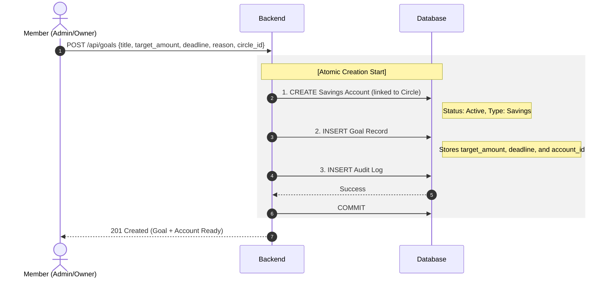
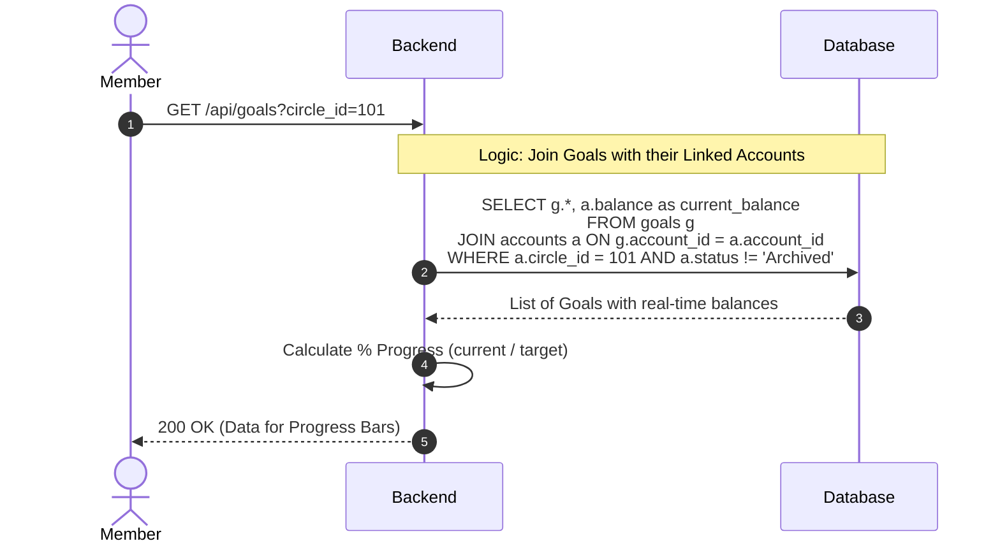

The Goal Creation Flow

```mermaid
sequenceDiagram
    autonumber
    actor User as Member (Admin/Owner)
    participant BE as Backend
    participant DB as Database

    User->>BE: POST /api/goals {title, target_amount, deadline, reason, circle_id}

    rect rgba(0, 0, 0, 0.05)
    Note over BE, DB: [Atomic Creation Start]

    BE->>DB: 1. CREATE Savings Account (linked to Circle)
    Note right of DB: Status: Active, Type: Savings

    BE->>DB: 2. INSERT Goal Record
    Note right of DB: Stores target_amount, deadline, and account_id

    BE->>DB: 3. INSERT Audit Log

    DB-->>BE: Success
    BE->>DB: COMMIT
    end

    BE-->>User: 201 Created (Goal + Account Ready)
```

Goal Fetching (Circle-Scoped)

```mermaid
sequenceDiagram
    autonumber
    actor Member
    participant BE as Backend
    participant DB as Database

    Member->>BE: GET /api/goals?circle_id=101

    Note over BE, DB: Logic: Join Goals with their Linked Accounts
    BE->>DB: SELECT g.*, a.balance as current_balance <br/>FROM goals g <br/>JOIN accounts a ON g.account_id = a.account_id <br/>WHERE a.circle_id = 101 AND a.status != 'Archived'

    DB-->>BE: List of Goals with real-time balances
    BE->>BE: Calculate % Progress (current / target)
    BE-->>Member: 200 OK (Data for Progress Bars)
```

