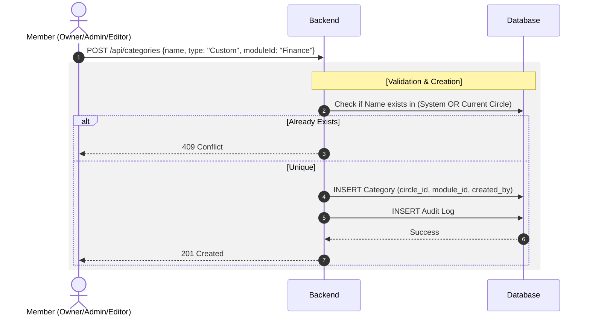
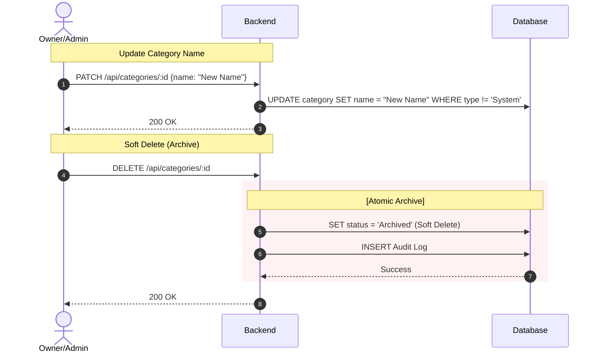
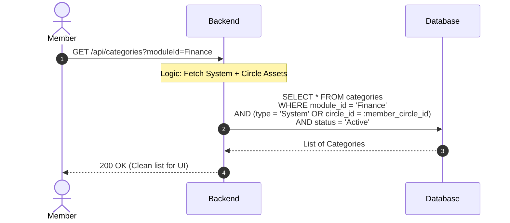
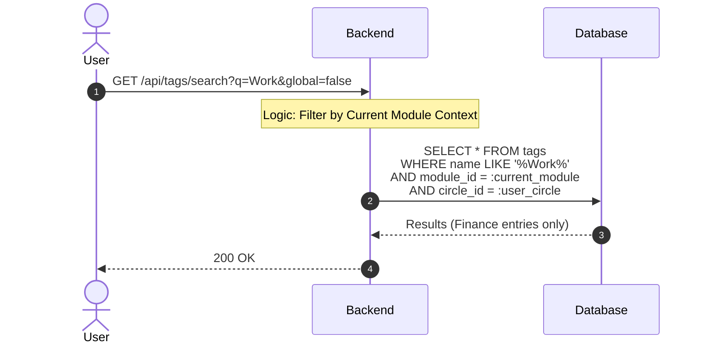

Create Category / Tag

```mermaid
sequenceDiagram
    autonumber
    actor User as Member (Owner/Admin/Editor)
    participant BE as Backend
    participant DB as Database

    User->>BE: POST /api/categories {name, type: "Custom", moduleId: "Finance"}

    rect rgba(0, 0, 0, 0.05)
    Note over BE, DB: [Validation & Creation]
    BE->>DB: Check if Name exists in (System OR Current Circle)
    alt Already Exists
        BE-->>User: 409 Conflict
    else Unique
        BE->>DB: INSERT Category (circle_id, module_id, created_by)
        BE->>DB: INSERT Audit Log
        DB-->>BE: Success
        BE-->>User: 201 Created
    end
    end
```

Update & Delete (Soft Delete)

```mermaid
sequenceDiagram
    autonumber
    actor User as Owner/Admin
    participant BE as Backend
    participant DB as Database

    Note over User, BE: Update Category Name
    User->>BE: PATCH /api/categories/:id {name: "New Name"}
    BE->>DB: UPDATE category SET name = "New Name" WHERE type != 'System'
    BE-->>User: 200 OK

    Note over User, BE: Soft Delete (Archive)
    User->>BE: DELETE /api/categories/:id
    rect rgba(255, 0, 0, 0.05)
    Note over BE, DB: [Atomic Archive]
    BE->>DB: SET status = 'Archived' (Soft Delete)
    BE->>DB: INSERT Audit Log
    DB-->>BE: Success
    end
    BE-->>User: 200 OK
```

Fetching (The Hybrid Logic)

```mermaid
sequenceDiagram
    autonumber
    actor Member
    participant BE as Backend
    participant DB as Database

    Member->>BE: GET /api/categories?moduleId=Finance

    Note over BE: Logic: Fetch System + Circle Assets
    BE->>DB: SELECT * FROM categories <br/>WHERE module_id = 'Finance' <br/>AND (type = 'System' OR circle_id = :member_circle_id) <br/>AND status = 'Active'

    DB-->>BE: List of Categories
    BE-->>Member: 200 OK (Clean list for UI)
```

Module-Scoped Tag Search

```mermaid
sequenceDiagram
    autonumber
    actor User
    participant BE as Backend
    participant DB as Database

    User->>BE: GET /api/tags/search?q=Work&global=false

    Note over BE: Logic: Filter by Current Module Context
    BE->>DB: SELECT * FROM tags <br/>WHERE name LIKE '%Work%' <br/>AND module_id = :current_module <br/>AND circle_id = :user_circle

    DB-->>BE: Results (Finance entries only)
    BE-->>User: 200 OK
```

