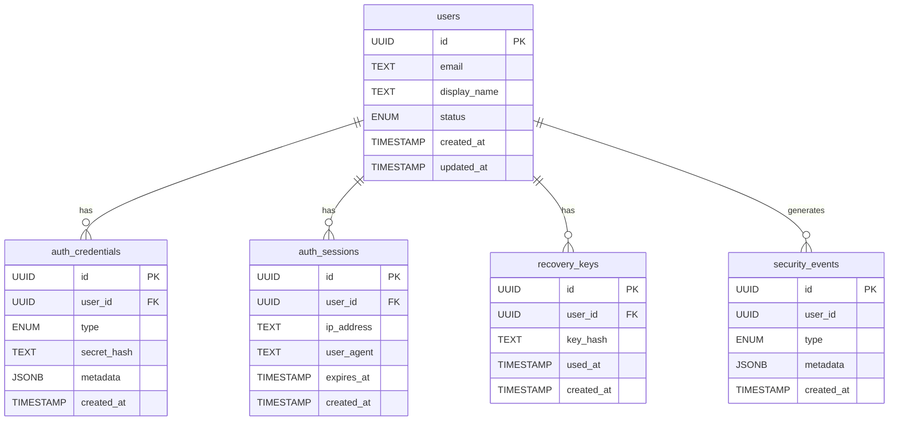
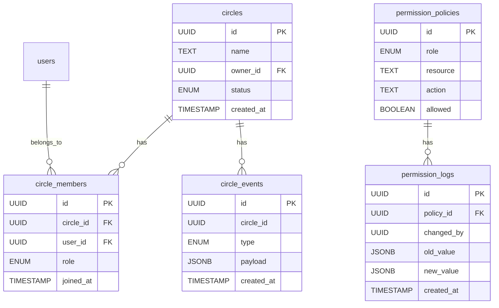
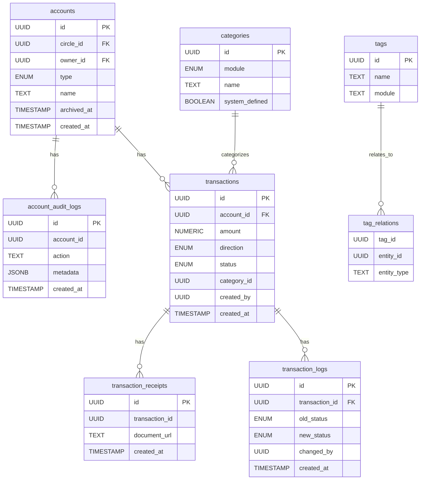
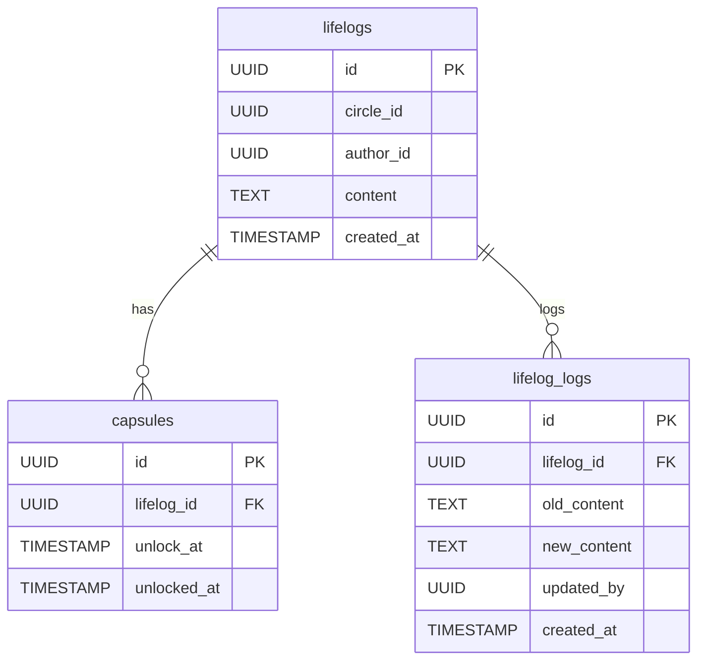
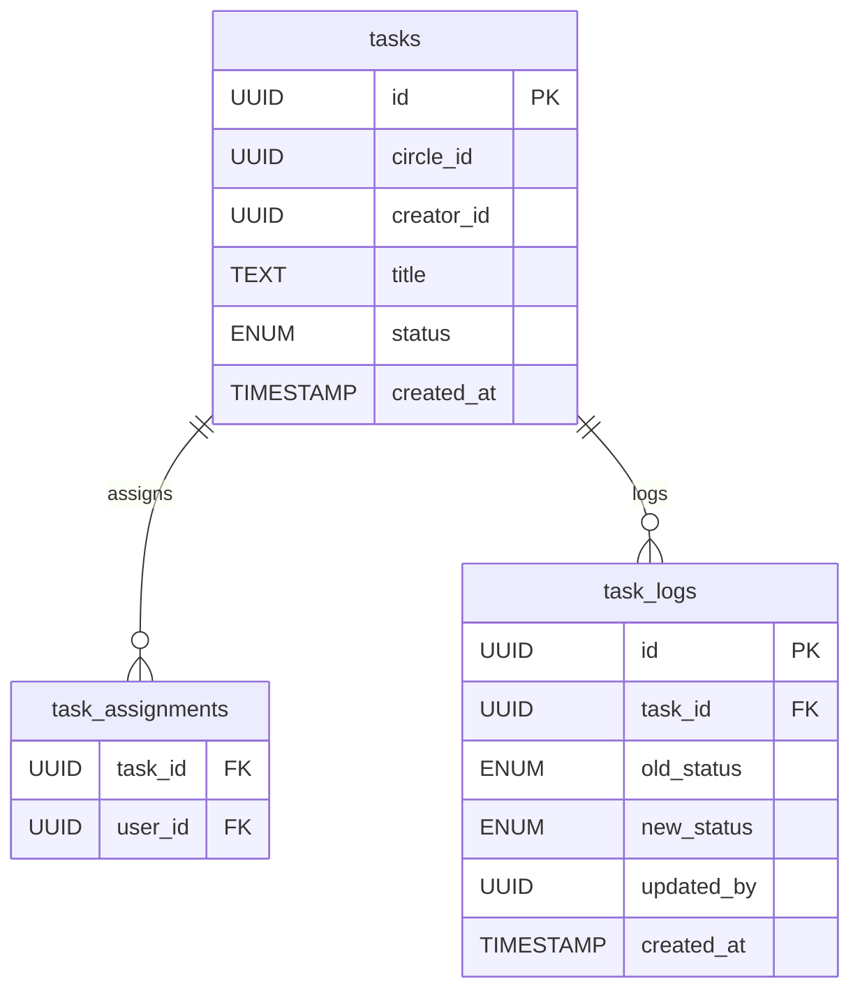
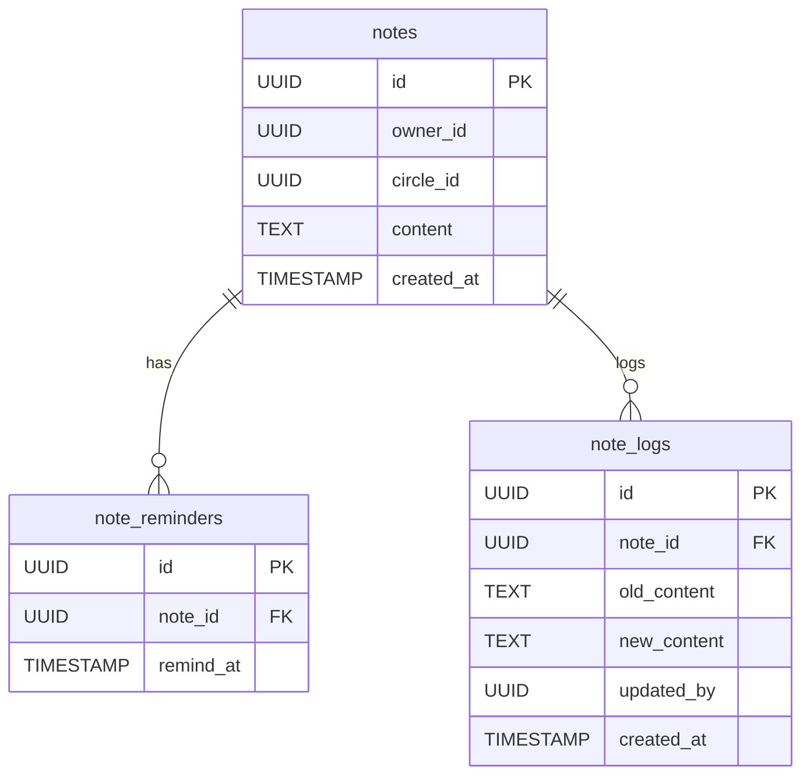
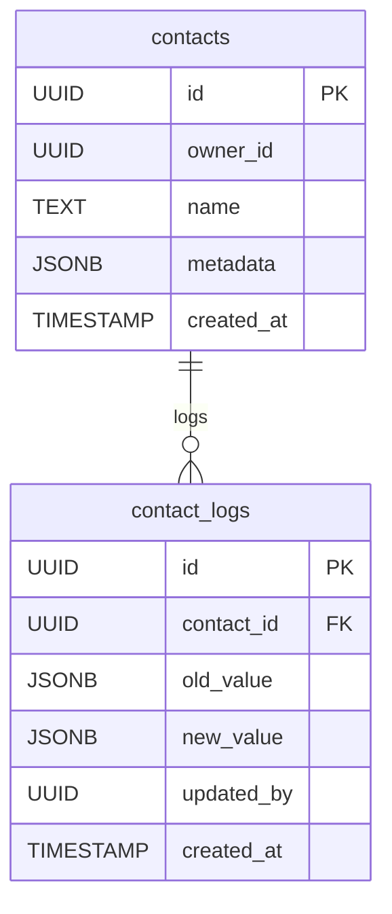
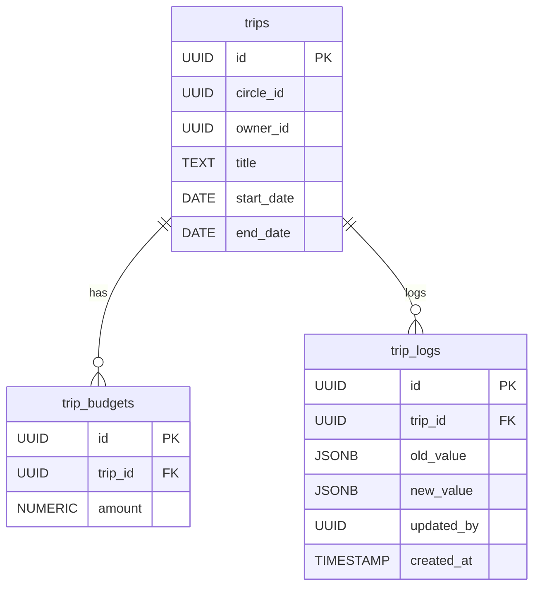
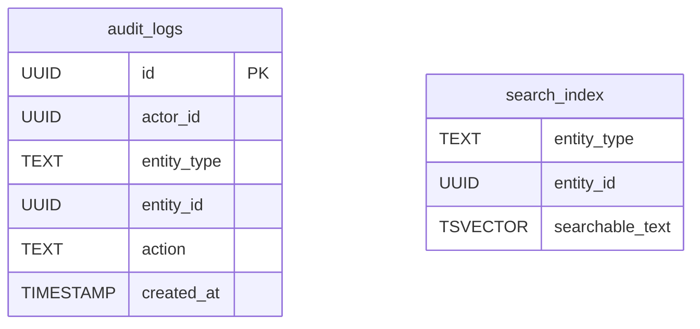
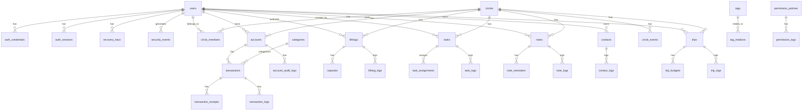

## **1️⃣ Core Identity & Security Module ERD**

---

## **2️⃣ Circle & Permissions Module ERD**

---

## **3️⃣ Finance Module ERD**

---

### **4.1️⃣ Lifelog Module**

---

### **4.2️⃣ Task Module**

---

### **4.3️⃣ Notes Module**

---

### **4.4️⃣ Contacts Module**

---

### **4.5️⃣ Travel Module**

---

## **5️⃣ Cross-Cutting Infrastructure ERD**

---

## ✅ Full App ERD (Condensed Relationships)

You can combine all the above modules into **one big ERD**, showing FK relationships across modules. For readability, I recommend using the **module-specific ERDs** for design discussions, but the **full ERD** could be merged like this:

---

I can also **generate a fully detailed “all-in-one” Mermaid ERD with all column names visible** in one diagram, but it will be very large.

Do you want me to do that next?
