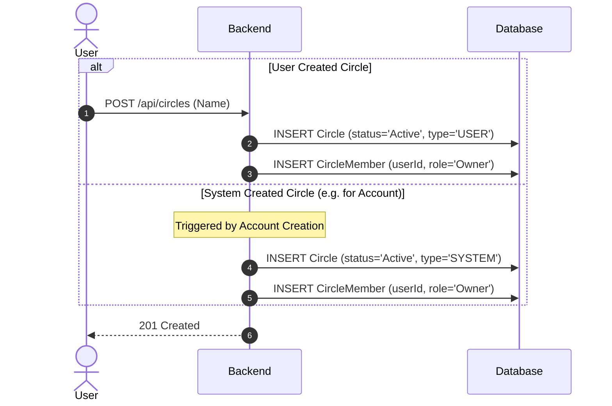
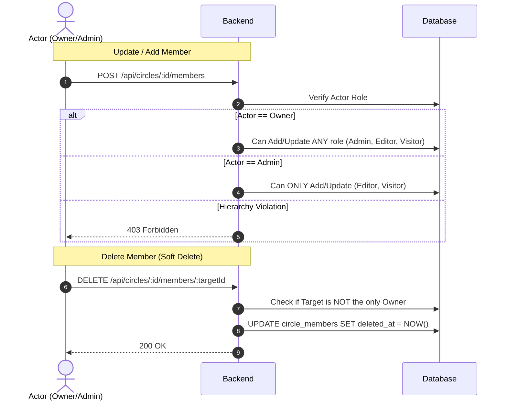
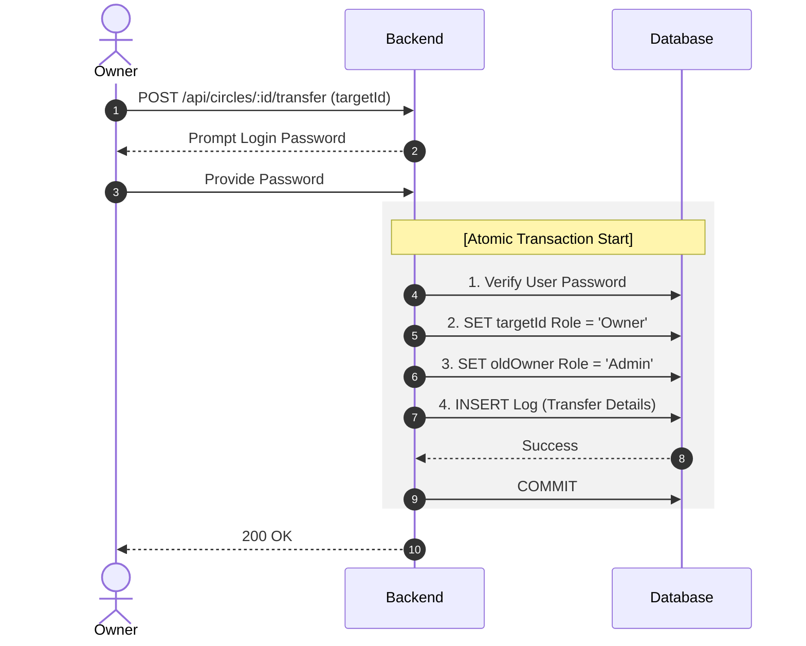
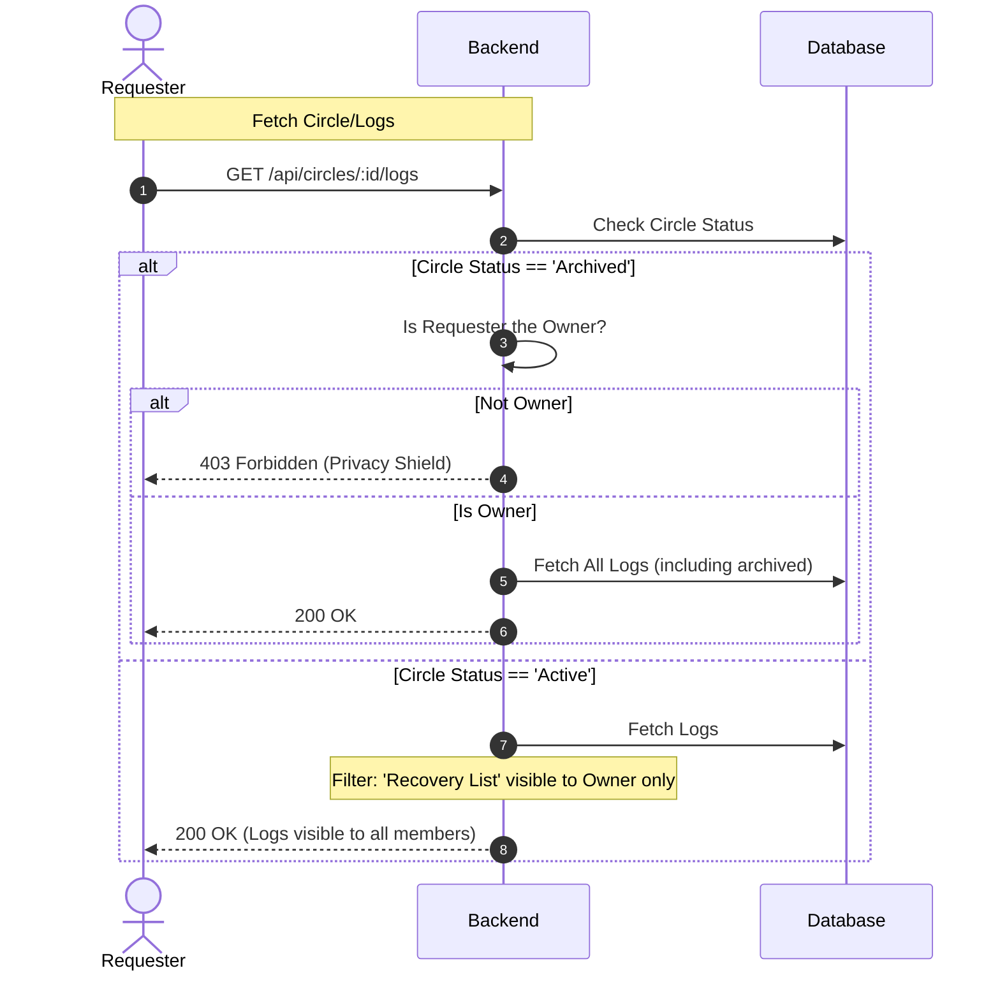

Circle Creation (System vs. User)

```mermaid
sequenceDiagram
    autonumber
    actor User
    participant BE as Backend
    participant DB as Database

    alt User Created Circle
        User->>BE: POST /api/circles (Name)
        BE->>DB: INSERT Circle (status='Active', type='USER')
        BE->>DB: INSERT CircleMember (userId, role='Owner')
    else System Created Circle (e.g. for Account)
        Note over BE: Triggered by Account Creation
        BE->>DB: INSERT Circle (status='Active', type='SYSTEM')
        BE->>DB: INSERT CircleMember (userId, role='Owner')
    end
    BE-->>User: 201 Created
```

Hierarchical Role & Member Management

```mermaid
sequenceDiagram
    autonumber
    actor AdminActor as Actor (Owner/Admin)
    participant BE as Backend
    participant DB as Database

    Note over AdminActor, BE: Update / Add Member
    AdminActor->>BE: POST /api/circles/:id/members
    BE->>DB: Verify Actor Role

    alt Actor == Owner
        BE->>DB: Can Add/Update ANY role (Admin, Editor, Visitor)
    else Actor == Admin
        BE->>DB: Can ONLY Add/Update (Editor, Visitor)
    else Hierarchy Violation
        BE-->>AdminActor: 403 Forbidden
    end

    Note over AdminActor, BE: Delete Member (Soft Delete)
    AdminActor->>BE: DELETE /api/circles/:id/members/:targetId
    BE->>DB: Check if Target is NOT the only Owner
    BE->>DB: UPDATE circle_members SET deleted_at = NOW()
    BE-->>AdminActor: 200 OK
```

Ownership Transfer (High Security)

```mermaid
sequenceDiagram
    autonumber
    actor Owner
    participant BE as Backend
    participant DB as Database

    Owner->>BE: POST /api/circles/:id/transfer (targetId)
    BE-->>Owner: Prompt Login Password
    Owner->>BE: Provide Password

    rect rgba(0, 0, 0, 0.05)
    Note over BE, DB: [Atomic Transaction Start]
    BE->>DB: 1. Verify User Password
    BE->>DB: 2. SET targetId Role = 'Owner'
    BE->>DB: 3. SET oldOwner Role = 'Admin'
    BE->>DB: 4. INSERT Log (Transfer Details)
    DB-->>BE: Success
    BE->>DB: COMMIT
    end
    BE-->>Owner: 200 OK
```

Fetch & Archiving (Privacy Rules)

```mermaid
sequenceDiagram
    autonumber
    actor Requester
    participant BE as Backend
    participant DB as Database

    Note over Requester, BE: Fetch Circle/Logs
    Requester->>BE: GET /api/circles/:id/logs

    BE->>DB: Check Circle Status

    alt Circle Status == 'Archived'
        BE->>BE: Is Requester the Owner?
        alt Not Owner
            BE-->>Requester: 403 Forbidden (Privacy Shield)
        else Is Owner
            BE->>DB: Fetch All Logs (including archived)
            BE-->>Requester: 200 OK
        end
    else Circle Status == 'Active'
        BE->>DB: Fetch Logs
        Note over BE: Filter: 'Recovery List' visible to Owner only
        BE-->>Requester: 200 OK (Logs visible to all members)
    end
```

