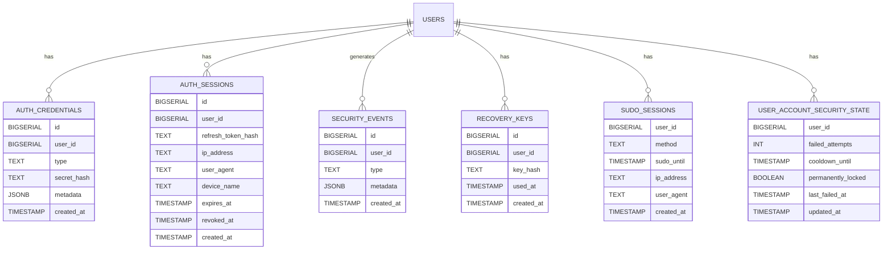
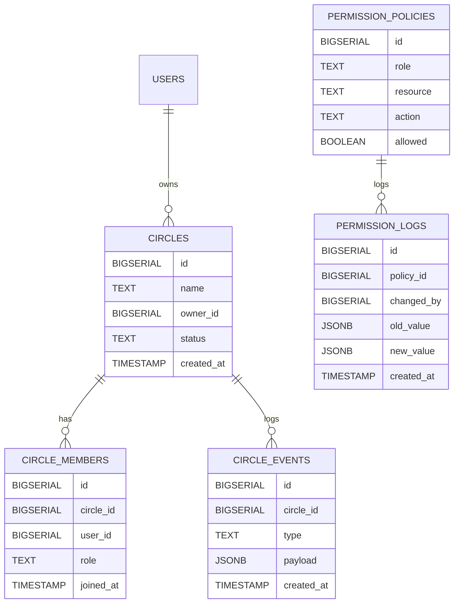
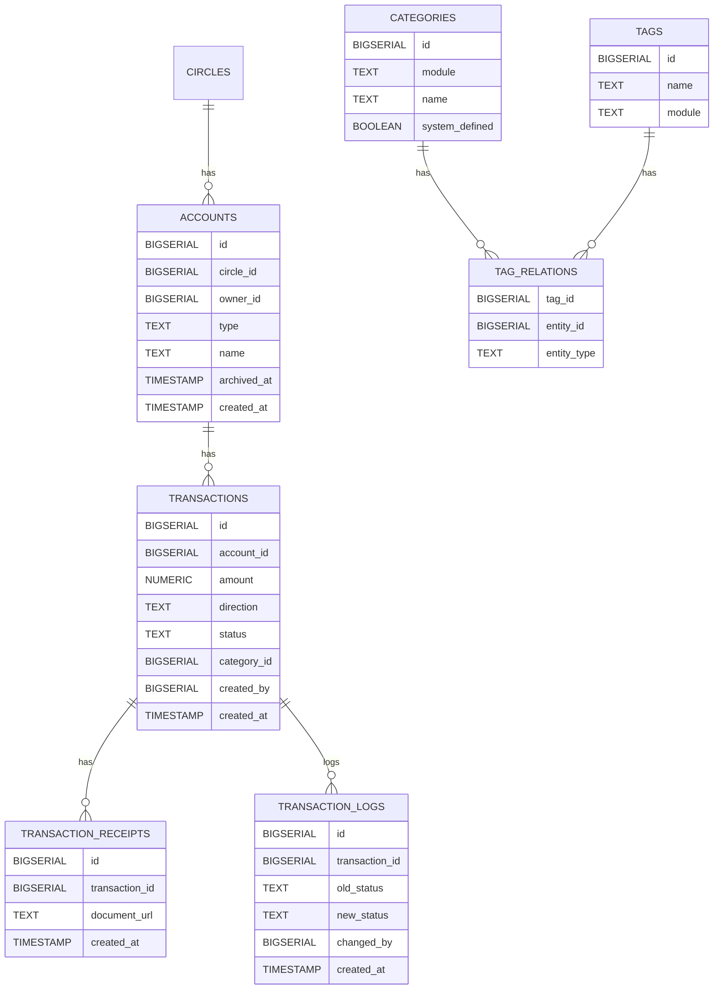
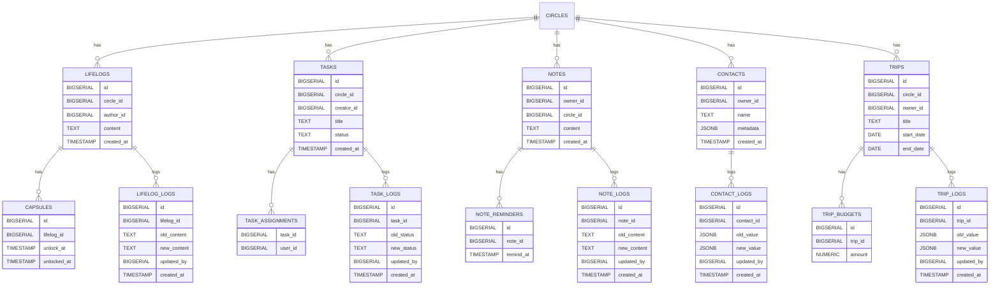
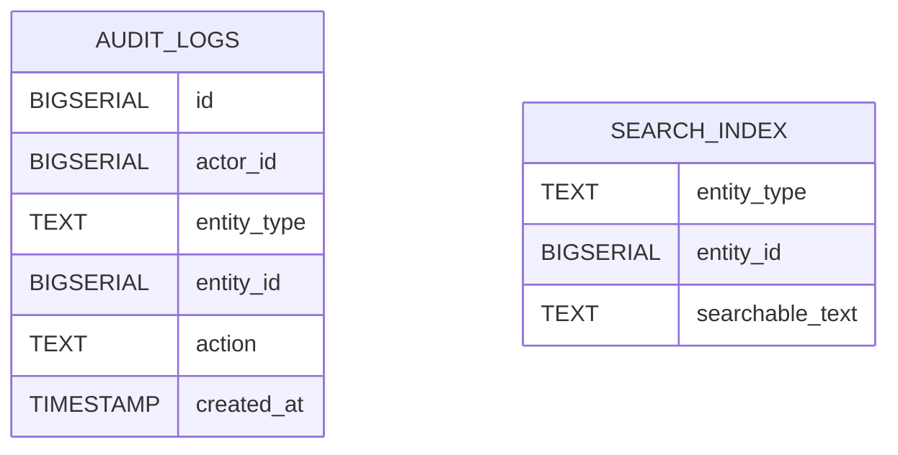

Perfect! We can split your large ERD **module by module** so it’s easier to visualize. I’ll create separate Mermaid diagrams for each major module, keeping relationships **within the module**.

---

## 🔐 **Core Identity & Security (Auth + Recovery + Security)**

---

## 👤 **User & Ownership (Users, Circles, Permissions)**

---

## 💰 **Finance System (Accounts, Transactions, Categories & Tags)**

---

## 🧬 **Life Systems (LifeLogs, Tasks, Notes, Contacts, Travel)**

---

## 🔍 **Cross-Cutting Modules (Audit & Search)**

---
