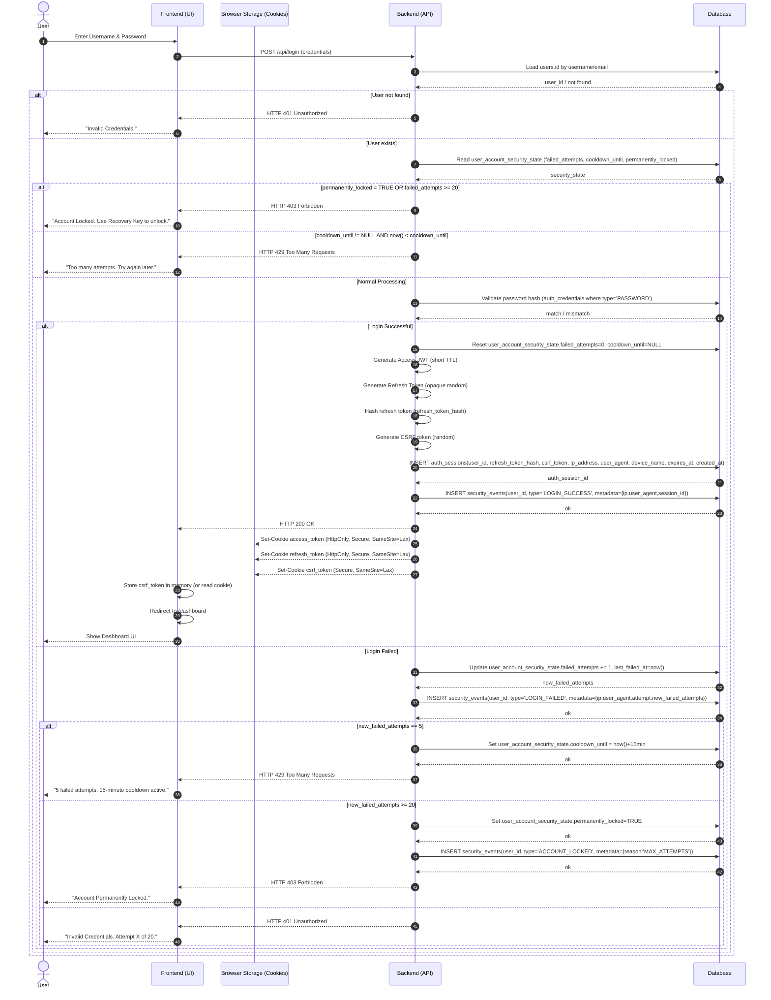
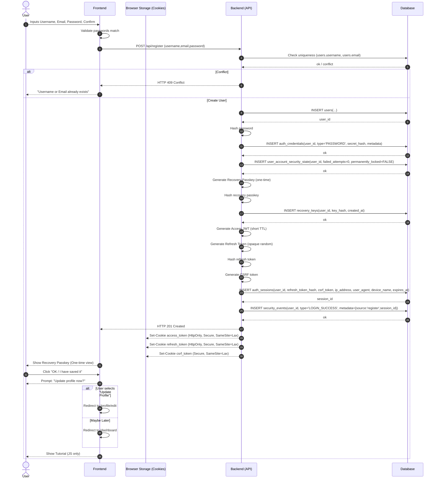
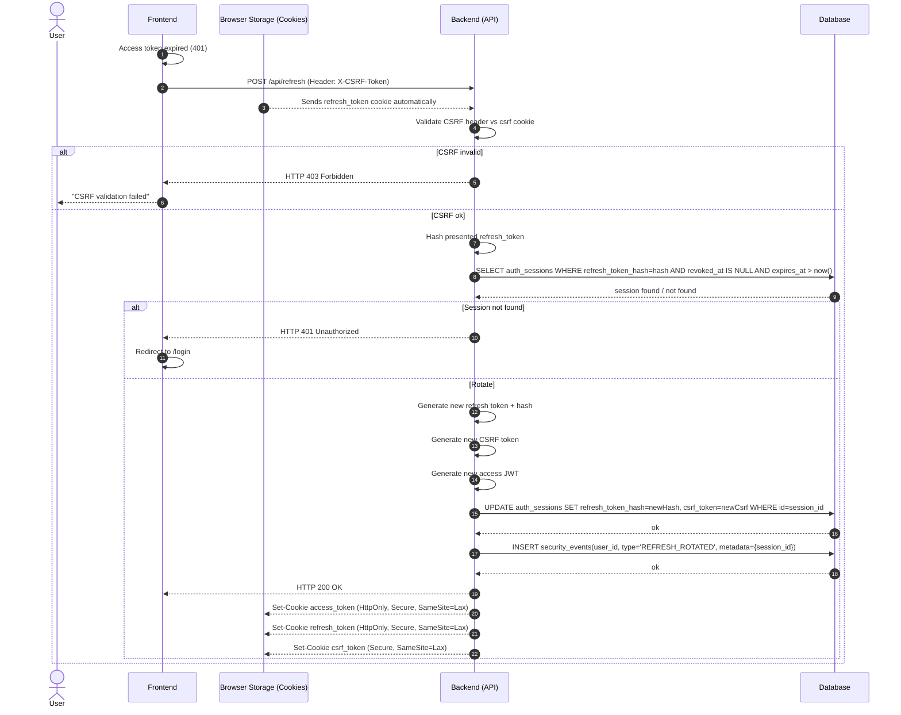
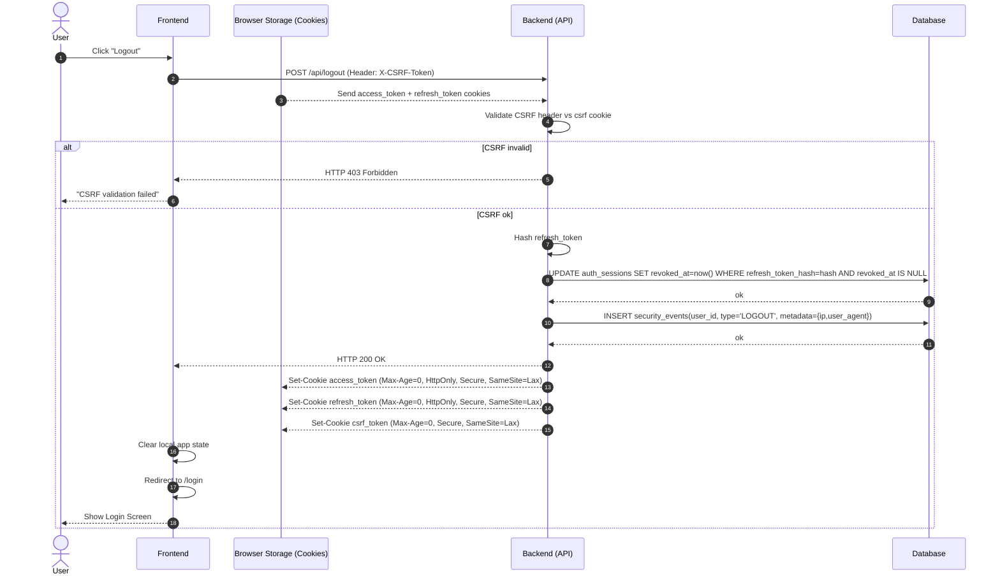
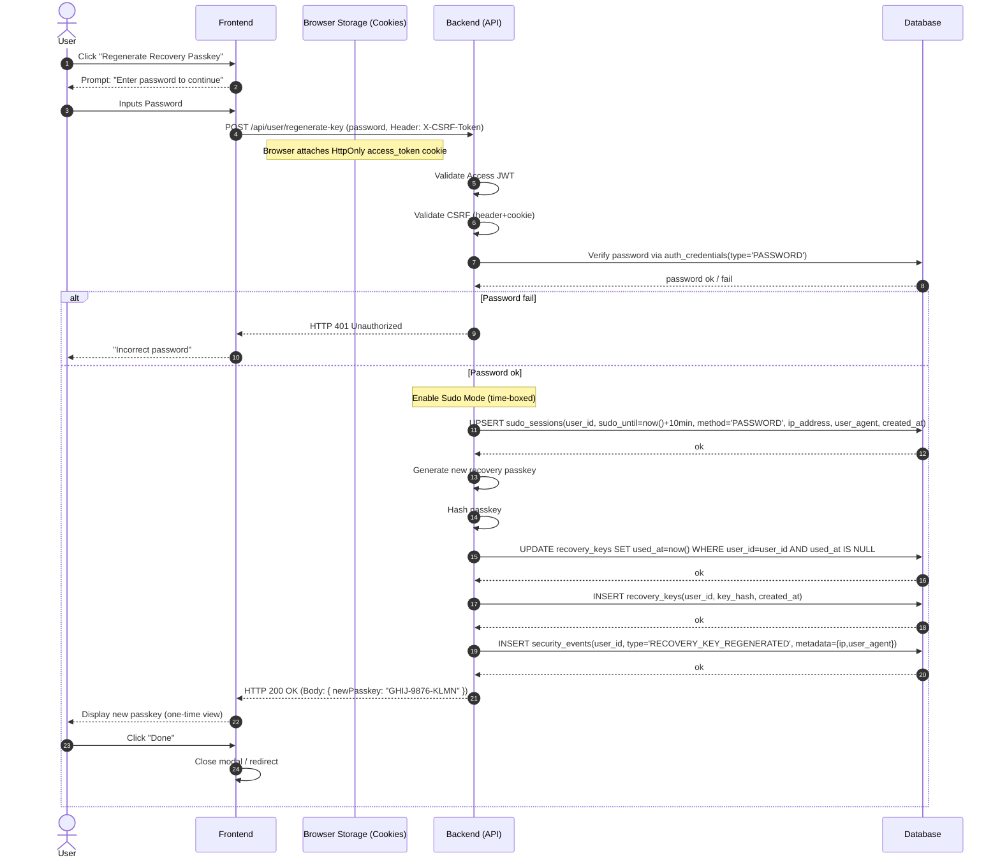
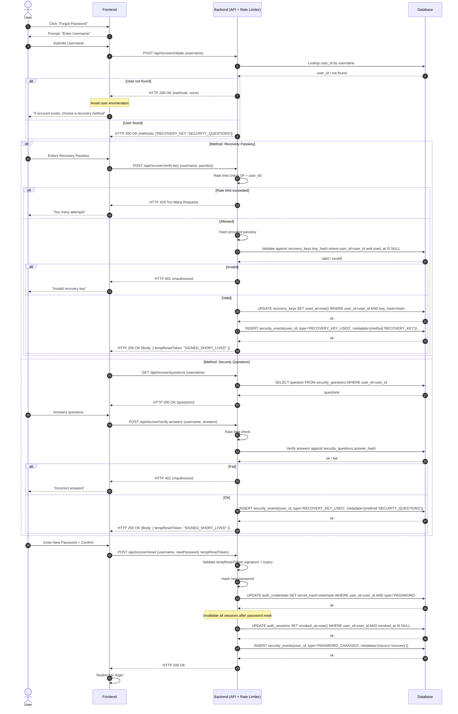

## ✅ Signin (fixed, strict-mermaid compatible)

---

## ✅ Sign up (fixed, strict-mermaid compatible)

---

## ✅ Refresh (fixed, strict-mermaid compatible)

---

## ✅ Logout (fixed, strict-mermaid compatible)

---

### **Regenerate Recovery Passkey (DB-aligned: sudo_sessions + recovery_keys update)**

Your DB has both `sudo_sessions` and `recovery_keys`, so this should explicitly touch both.

---

### **Forgot Password (DB-aligned: uses recovery_keys / security_questions + rate limit + password credential update)**

No extra tables were defined for temp tokens, so I model temp token as **signed/short-lived** (or you can add a table later).

---

#