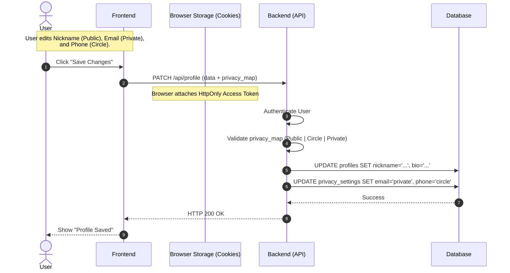
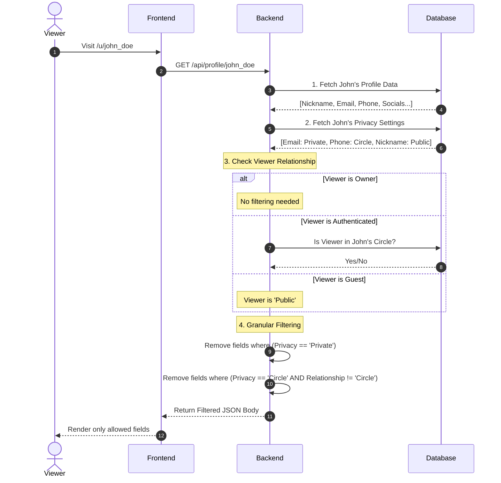

# Profile

**Update Profile & Granular Privacy**

```mermaid
sequenceDiagram
    autonumber
    actor User
    participant FE as Frontend
    participant Browser as Browser Storage (Cookies)
    participant BE as Backend (API)
    participant DB as Database

    Note over User, FE: User edits Nickname (Public), Email (Private),<br/>and Phone (Circle).

    User->>FE: Click "Save Changes"

    FE->>BE: PATCH /api/profile (data + privacy_map)
    Note over Browser: Browser attaches HttpOnly Access Token

    BE->>BE: Authenticate User
    BE->>BE: Validate privacy_map (Public | Circle | Private)

    BE->>DB: UPDATE profiles SET nickname='...', bio='...'
    BE->>DB: UPDATE privacy_settings SET email='private', phone='circle'
    DB-->>BE: Success

    BE-->>FE: HTTP 200 OK
    FE-->>User: Show "Profile Saved"
```

**View Profile (The Gatekeeper Logic)**

```mermaid
sequenceDiagram
    autonumber
    actor Viewer
    participant FE as Frontend
    participant BE as Backend
    participant DB as Database

    Viewer->>FE: Visit /u/john_doe
    FE->>BE: GET /api/profile/john_doe

    BE->>DB: 1. Fetch John's Profile Data
    DB-->>BE: [Nickname, Email, Phone, Socials...]

    BE->>DB: 2. Fetch John's Privacy Settings
    DB-->>BE: [Email: Private, Phone: Circle, Nickname: Public]

    Note over BE: 3. Check Viewer Relationship

    alt Viewer is Owner
        Note over BE: No filtering needed
    else Viewer is Authenticated
        BE->>DB: Is Viewer in John's Circle?
        DB-->>BE: Yes/No
    else Viewer is Guest
        Note over BE: Viewer is 'Public'
    end

    Note over BE: 4. Granular Filtering
    BE->>BE: Remove fields where (Privacy == 'Private')
    BE->>BE: Remove fields where (Privacy == 'Circle' AND Relationship != 'Circle')

    BE-->>FE: Return Filtered JSON Body
    FE-->>Viewer: Render only allowed fields
```
