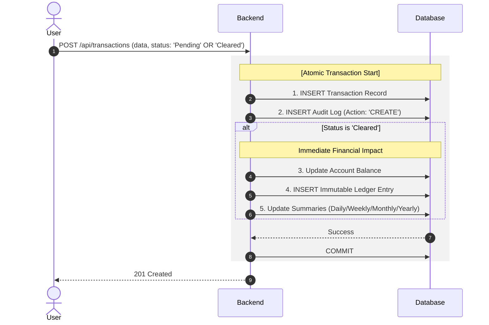
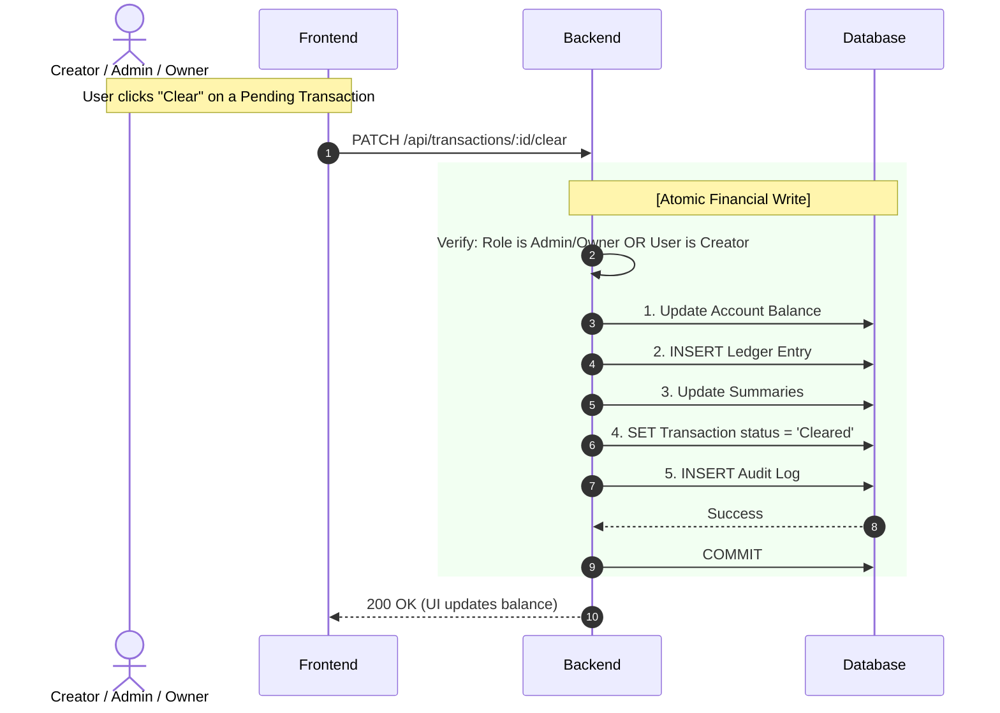
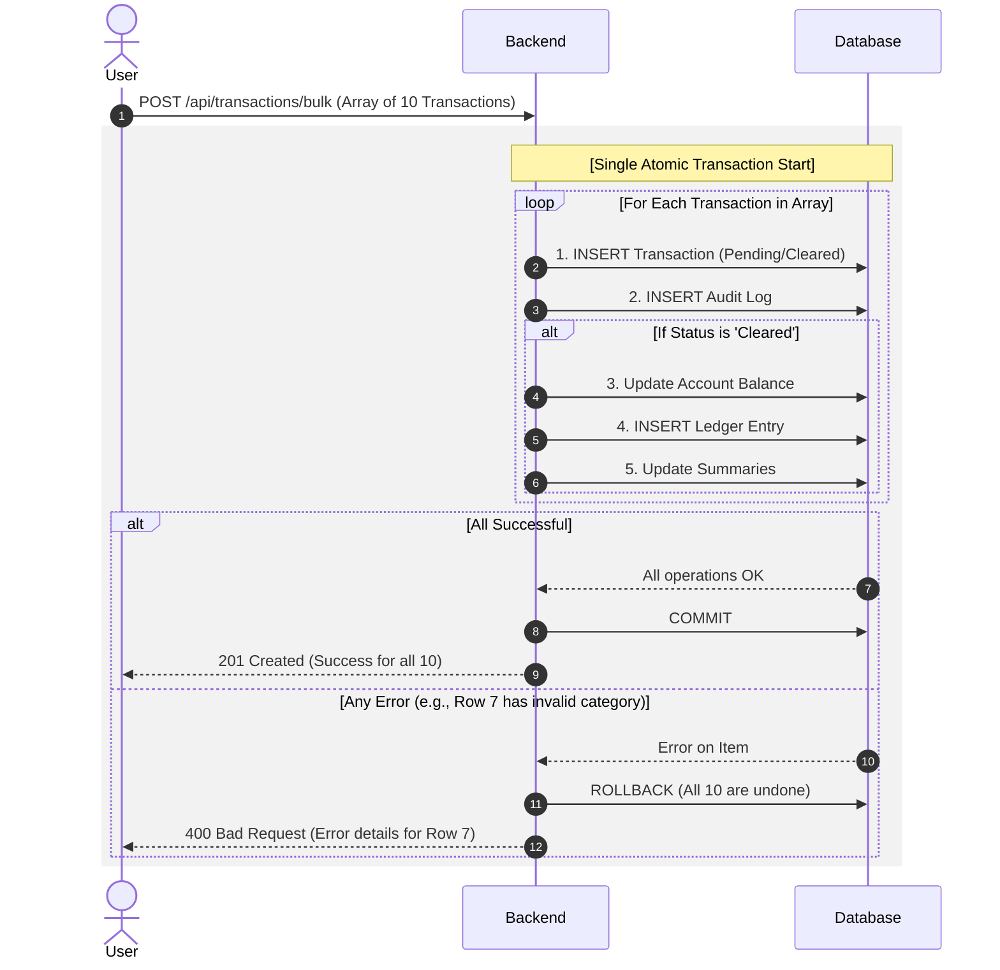
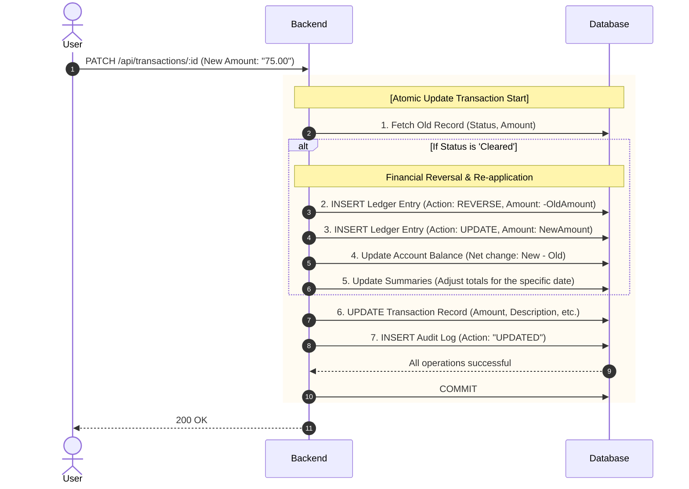
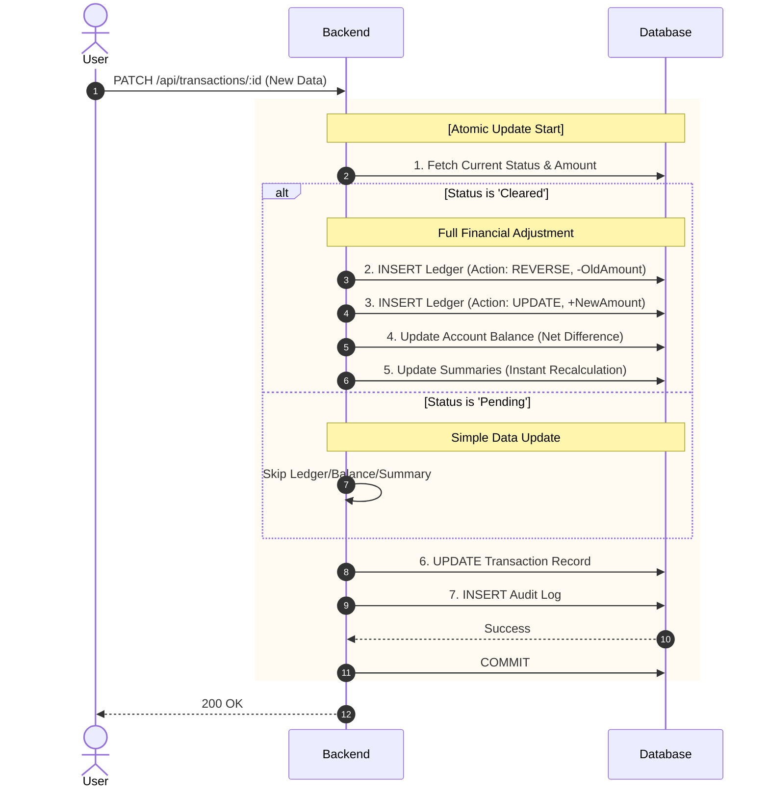
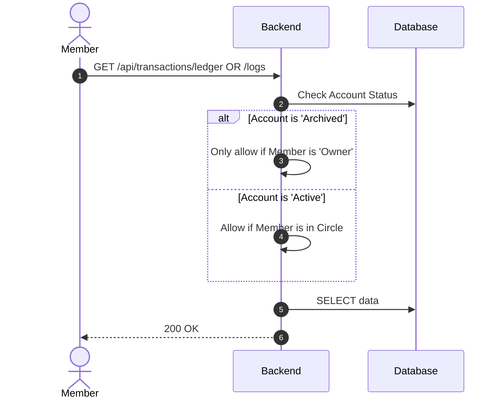

**The Transaction Lifecycle (Pending to Cleared)**



**The "Manual Confirmation" Flow (Post-Creation)**



**Bulk Transaction Creation (Atomic Batch)**



**Update Logic (Immutable Ledger Pattern)**



**Void & Revive (Soft Delete Only)**



**Visibility & Fetching**



---

```mermaid

```
