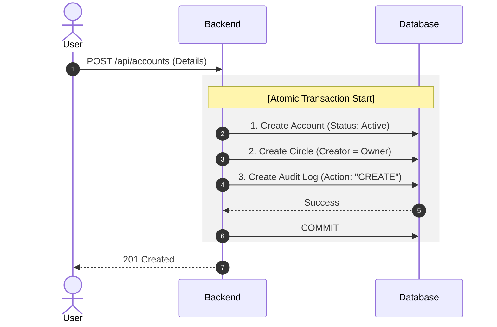
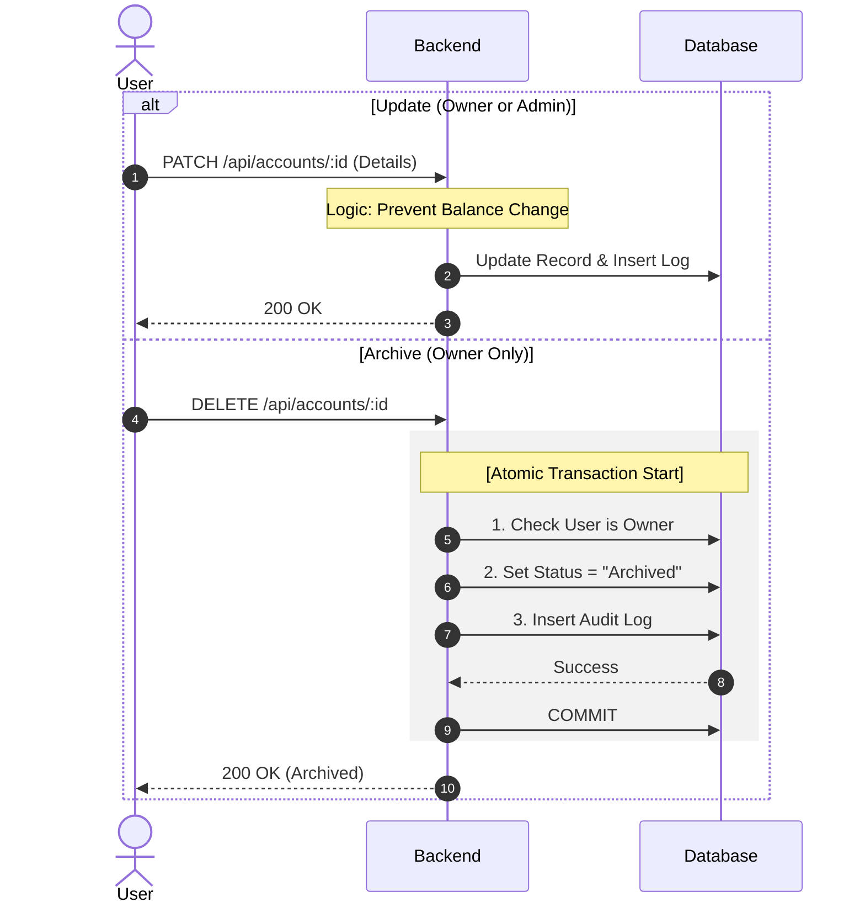
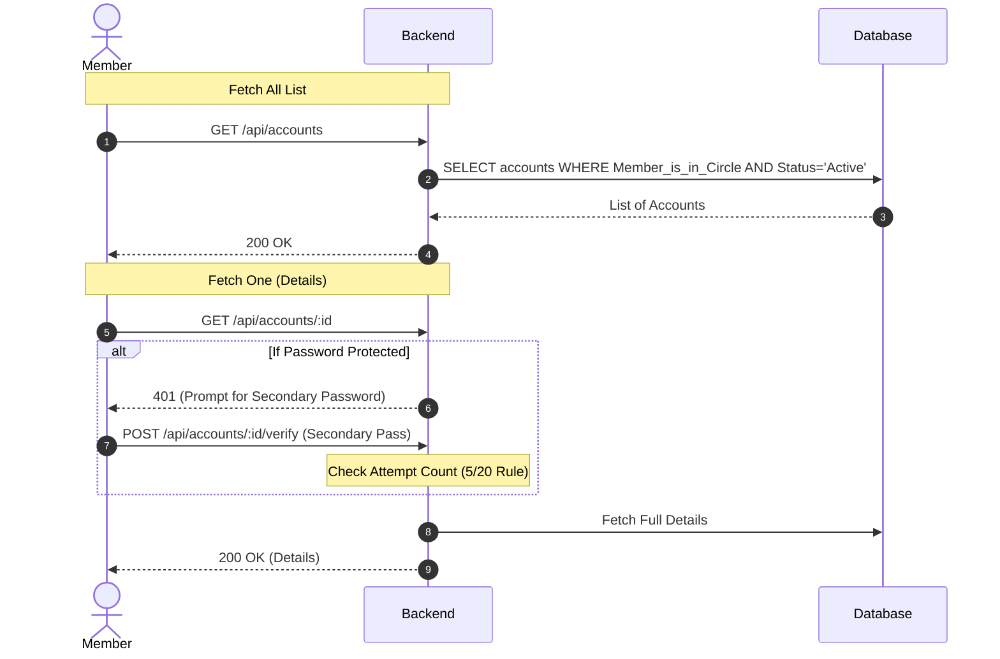
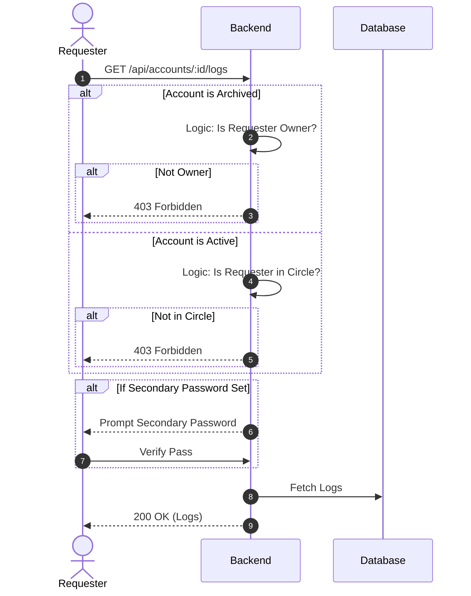
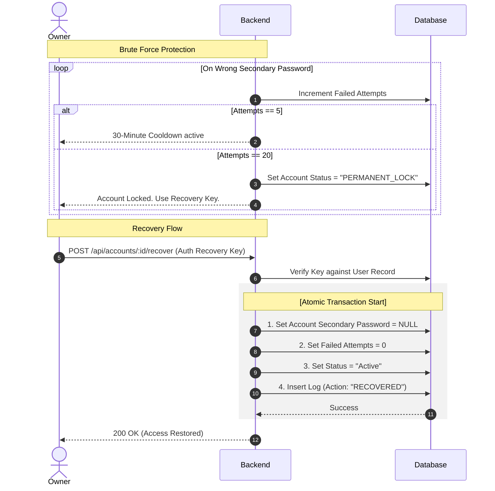
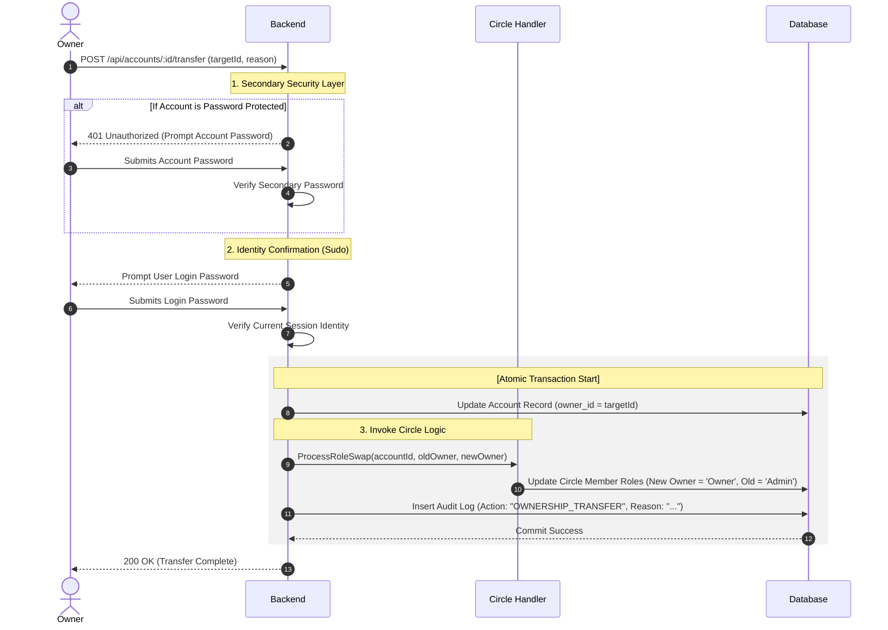

## Account Creation (Atomic)

## Update & Archive (Soft Delete)

## Fetch List & Fetch One (Circle-Based)

## Audit Log Fetching (Privacy Rules)

## Security Lockout & Recovery

## Transfer Ownership (Double Verification)

