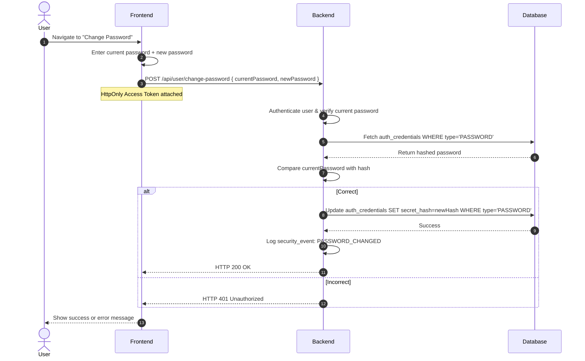
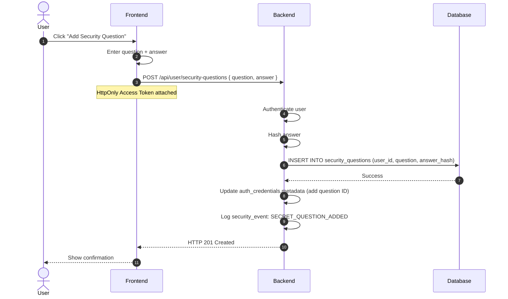
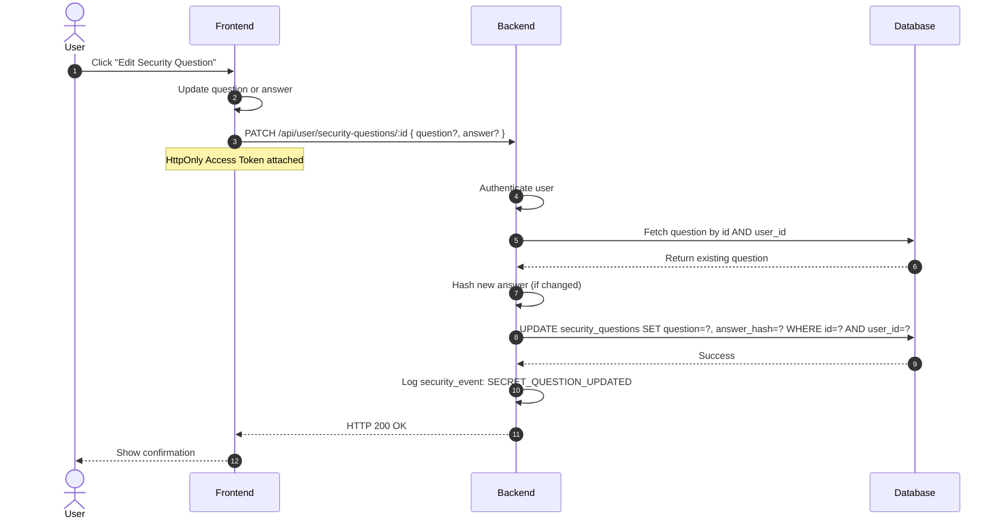
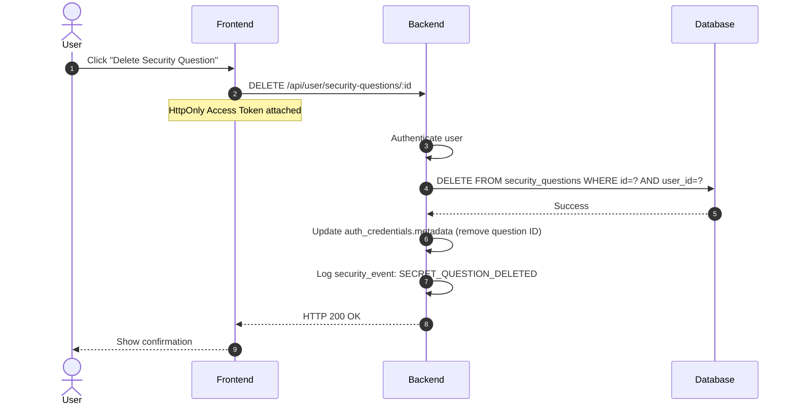
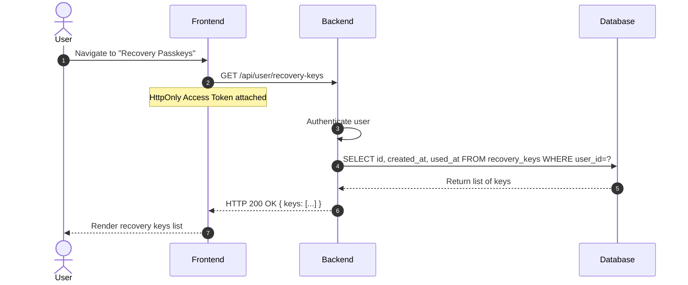

# Change Password (Logged in)

```mermaid
sequenceDiagram
    autonumber
    actor User
    participant FE as Frontend
    participant BE as Backend
    participant DB as Database

    User->>FE: Navigate to "Change Password"
    FE->>FE: Enter current password + new password
    FE->>BE: POST /api/user/change-password { currentPassword, newPassword }
    Note over FE: HttpOnly Access Token attached

    BE->>BE: Authenticate user & verify current password
    BE->>DB: Fetch auth_credentials WHERE type='PASSWORD'
    DB-->>BE: Return hashed password

    BE->>BE: Compare currentPassword with hash
    alt Correct
        BE->>DB: Update auth_credentials SET secret_hash=newHash WHERE type='PASSWORD'
        DB-->>BE: Success
        BE->>BE: Log security_event: PASSWORD_CHANGED
        BE-->>FE: HTTP 200 OK
    else Incorrect
        BE-->>FE: HTTP 401 Unauthorized
    end

    FE-->>User: Show success or error message

```

# Security Question Management

## Add Question

```mermaid
sequenceDiagram
    autonumber
    actor User
    participant FE as Frontend
    participant BE as Backend
    participant DB as Database

    User->>FE: Click "Add Security Question"
    FE->>FE: Enter question + answer
    FE->>BE: POST /api/user/security-questions { question, answer }
    Note over FE: HttpOnly Access Token attached

    BE->>BE: Authenticate user
    BE->>BE: Hash answer
    BE->>DB: INSERT INTO security_questions (user_id, question, answer_hash)
    DB-->>BE: Success
    BE->>BE: Update auth_credentials.metadata (add question ID)
    BE->>BE: Log security_event: SECRET_QUESTION_ADDED
    BE-->>FE: HTTP 201 Created
    FE-->>User: Show confirmation

```

## Update Question

```mermaid
sequenceDiagram
    autonumber
    actor User
    participant FE as Frontend
    participant BE as Backend
    participant DB as Database

    User->>FE: Click "Edit Security Question"
    FE->>FE: Update question or answer
    FE->>BE: PATCH /api/user/security-questions/:id { question?, answer? }
    Note over FE: HttpOnly Access Token attached

    BE->>BE: Authenticate user
    BE->>DB: Fetch question by id AND user_id
    DB-->>BE: Return existing question

    BE->>BE: Hash new answer (if changed)
    BE->>DB: UPDATE security_questions SET question=?, answer_hash=? WHERE id=? AND user_id=?
    DB-->>BE: Success
    BE->>BE: Log security_event: SECRET_QUESTION_UPDATED
    BE-->>FE: HTTP 200 OK
    FE-->>User: Show confirmation


```

## Delete Question

```mermaid

sequenceDiagram
    autonumber
    actor User
    participant FE as Frontend
    participant BE as Backend
    participant DB as Database

    User->>FE: Click "Delete Security Question"
    FE->>BE: DELETE /api/user/security-questions/:id
    Note over FE: HttpOnly Access Token attached

    BE->>BE: Authenticate user
    BE->>DB: DELETE FROM security_questions WHERE id=? AND user_id=?
    DB-->>BE: Success
    BE->>BE: Update auth_credentials.metadata (remove question ID)
    BE->>BE: Log security_event: SECRET_QUESTION_DELETED
    BE-->>FE: HTTP 200 OK
    FE-->>User: Show confirmation

```

# View Recovery Passkeys

```mermaid
sequenceDiagram
    autonumber
    actor User
    participant FE as Frontend
    participant BE as Backend
    participant DB as Database

    User->>FE: Navigate to "Recovery Passkeys"
    FE->>BE: GET /api/user/recovery-keys
    Note over FE: HttpOnly Access Token attached

    BE->>BE: Authenticate user
    BE->>DB: SELECT id, created_at, used_at FROM recovery_keys WHERE user_id=?
    DB-->>BE: Return list of keys
    BE-->>FE: HTTP 200 OK { keys: [...] }
    FE-->>User: Render recovery keys list

```